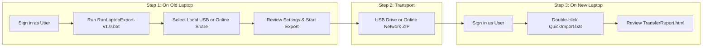
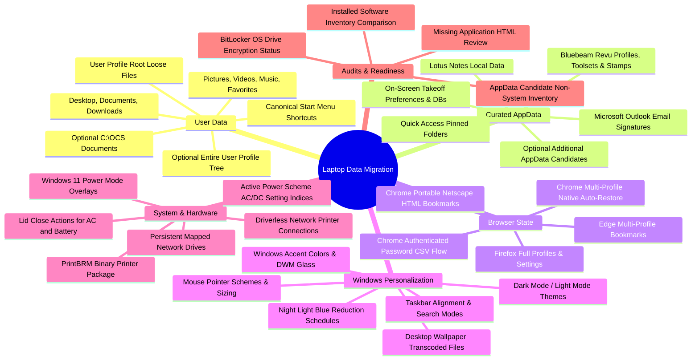

# STO Building Group — Laptop Transfer & Migration Tool (v1.0)

[](https://microsoft.com/powershell)
[](https://microsoft.com/windows)
[](docs/VERSION_COMPARISON.md)
[](TRANSFER_ARCHITECTURE.md)

A high-performance, single-file PowerShell automation suite designed for **IT Technicians, Help Desk Specialists, and Systems Administrators** to streamline laptop refreshes and employee hardware migrations across the enterprise.

It captures user data, application preferences, browser profiles, Windows personalization, and system configurations on the **old laptop**, packages the migration payload into a structured, self-contained transfer package (or network ZIP), and generates a matching one-click **Import Tool**, a **QuickImport launcher**, and an interactive **HTML Audit Report** to execute on the **new laptop**.

---

## 📚 Documentation Navigation

| Documentation Guide | Target Audience | Description |
|---|---|---|
| 📖 **[IT Technician Field Guide & SOP](docs/IT_TECHNICIAN_GUIDE.md)** | Help Desk & Field Techs | Printable Standard Operating Procedure, step-by-step checklists, preflight verification, and post-import handoff. |
| 🔍 **[Comprehensive Troubleshooting Guide](docs/TROUBLESHOOTING.md)** | IT Support & Engineers | Deep troubleshooting decision tree, Robocopy exit code reference, BitLocker statuses, UAC remediation, and disaster recovery. |
| 🏗️ **[Technical Architecture & Deep Dive](docs/TECHNICAL_DEEP_DIVE.md)** | Developers & System Architects | Exhaustive, stage-by-stage engineering reference, Win32 P/Invoke signatures, COM interop, registry keys, and Mermaid diagrams. |
| 📊 **[Version Comparison & Lineage Matrix](docs/VERSION_COMPARISON.md)** | IT Leads & Project Audits | 26-dimension comparative matrix tracing evolution from v0.7 (Structure Tone Fork) through v0.8, v0.9, to v1.0. |
| 🛠️ **[Developer Source & Build Guide](src/README.md)** | Maintainers & Contributors | Guide to the modular `src/` directory, `Build-Deployment.ps1` compiler, and Pester automated regression suite. |

---

## ⚡ Quick-Start: 3-Step Migration Workflow



### Step 1: Export Data on Old Laptop
1. Sign into Windows on the **old laptop** as the employee being transferred.
2. Close all running browsers (Chrome, Edge, Firefox), Outlook, Teams, and Bluebeam.
3. Run **`RunLaptopExport-v1.0.bat`** (or `QuickExport.bat`):
   ```cmd
   RunLaptopExport-v1.0.bat
   ```
4. Select **`[1] Local`** (for external USB drive) or **`[2] Online`** (for company network share).
5. Choose destination, press **`S`** to Start, and let the tool collect data.
6. When complete, review the generated **`TransferReport.html`**.

### Step 2: Move Transfer Package
- **Local:** Unplug the USB drive and plug it into the new laptop.
- **Online:** Locate the `LaptopTransfer_<timestamp>.zip` on the network share and extract it onto the new laptop (e.g. `C:\LaptopTransfers`).

### Step 3: Restore Data on New Laptop
1. Sign into the **new laptop** as the transferred user.
2. Open the transfer package folder and **double-click `QuickImport.bat`**.
   > [!IMPORTANT]
   > Run as standard user! **Do NOT right-click "Run as Administrator"**. The script runs as the standard user to restore profile data correctly, and will prompt for admin approval at the end for power and printers.
3. Follow on-screen prompts for optional Chrome password import and elevated system tasks.
4. Verify application readiness in **`TransferReport.html`** and **`Logs\AppMigrationReview.html`**.

---

## 🎛️ Transfer Modes: Local vs. Online

| Feature | 💾 Local Mode | 🌐 Online Mode |
|---|---|---|
| **Primary Use Case** | On-site migration via USB 3.0 / portable SSD | Remote migration, Wi-Fi, or direct network share (`\\server\share`) |
| **Payload Strategy** | Full comprehensive copy | Lean, bandwidth-optimized payload |
| **Downloads Folder** | Included by default | Included by default with 5 GB warning ceiling |
| **Google Chrome** | Bookmarks + Passwords (or opt-in Full Profile) | Bookmarks + Passwords (lean, no large cache folders) |
| **ZIP Archive** | Optional (OFF by default) | **Automatic:** Built locally, then uploaded as single file |
| **Network Staging** | Not needed (writes directly to USB) | **Local Staging:** Builds in `%LOCALAPPDATA%` first to prevent slow SMB writes |
| **Lotus Notes Data** | Included from `AppData\Local\Lotus` | Omitted by default for bandwidth speed |

---

## 📦 What the Tool Migrates



---

## 🔒 Security & Architecture Highlights

1. **The Scoped Elevation Invariant:**
   The primary exporter and importer run strictly within the interactive user's security context. This guarantees that `$env:USERPROFILE` and `HKCU:` point to the authentic user's profile and registry hives. Administrative rights (UAC) are requested *only* at the end of the run for a 5-second scoped helper handling `powercfg /export` and `PrintBrm.exe`.
2. **Zero-I/O Robocopy Performance Monitor:**
   v1.0 eliminates expensive destination disk rescans. Transfers utilize `/MT:16` parallel streams with a runspace-safe terminal spinner, achieving 40–60% faster throughput on large profiles with zero disk thrashing.
3. **Atomic Manifest Tracking (`SystemExport.json`):**
   System settings and printer export provenance are tracked via atomic file replacements (`System.IO.File.Replace`), giving the technician unambiguous evidence on whether admin-level captures succeeded.
4. **Shell BitLocker Status Detection:**
   Queries Windows Shell COM properties to verify operating system drive encryption without requiring administrator privileges.
5. **Native Chromium Profile Bookmark Auto-Restore:**
   Directly restores JSON bookmark stores into matching destination profiles while retaining portable Netscape HTML as a universal fallback.
6. **Taskbar Layout Fidelity:**
   Captures pinned link shortcuts, preserves `Taskband` registry ordering, automatically excludes Microsoft Store links, and executes a post-restart Explorer shell reconciliation to unpin unwanted default imaging apps.

---

## 📁 Output Package Directory Layout

```text
LaptopTransfer_YYYYMMDD_HHMMSS/
├── UserData/              # Desktop, Documents, Downloads, Favorites, Start Menu, Pictures
├── AppData/               # Bluebeam Revu settings, Outlook signatures, Quick Access, Lotus
├── Settings/              # SystemSettings.json, SystemExport.json, Taskbar pins, Mapped Drives
├── BrowserData/           # Chrome, Edge, and Firefox bookmarks, stores, and profiles
├── Printers/              # Network printer connections JSON & PrintBRM .printerExport
├── Logs/                  # ExportLog.txt, AdminExportLog.txt, robocopy execution logs
├── Import-LaptopData.ps1  # Automated restoration PowerShell script for new machine
├── Import-SystemSettings.ps1 # Scoped elevated helper for power & PrintBRM on new machine
├── QuickImport.bat        # Double-click launcher (runs as signed-in user)
└── TransferReport.html    # Standalone interactive audit report (UTF-8 BOM encoded)

LaptopTransfer_YYYYMMDD_HHMMSS.zip  # Present whenever ZIP creation is enabled
```

---

## 🛠️ Developer & Build Workflow

Technicians execute the self-contained `Export-LaptopData.ps1`, but developers maintain the modular scripts in `src/`.

### Building the Deployment Artifact:
```powershell
powershell -ExecutionPolicy Bypass -File ".\Build-Deployment.ps1"
```
*The build script validates syntax, concatenates modules in strict dependency order, embeds `00-development-config.psd1` and `TransferReport.template.html`, and writes the compiled `Export-LaptopData.ps1` artifact.*

### Running Automated Pester Regression Suite:
```powershell
powershell -ExecutionPolicy Bypass -File ".\Invoke-LaptopExportTests.ps1"
```
*The test harness runs 28+ automated unit and contract tests in Pester validating destination safety, payload limits, Robocopy zero-rescan contracts, and `-TestMode` dry-run imports against synthetic fixtures.*

---

## 📄 License & Organizational Context

Developed for **STO Building Group** IT Operations & Systems Engineering.  
*Designed for enterprise Windows 10 and Windows 11 migrations.*
