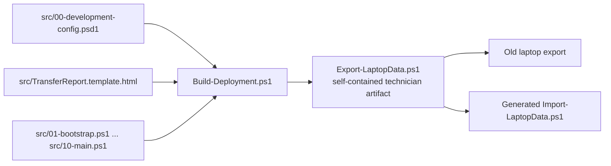
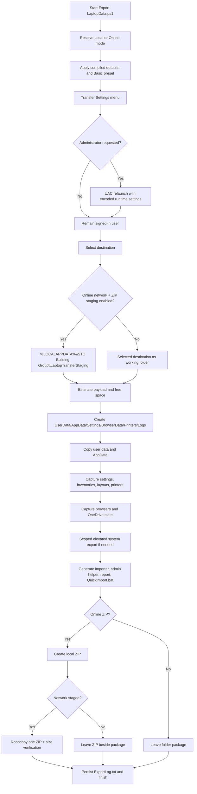
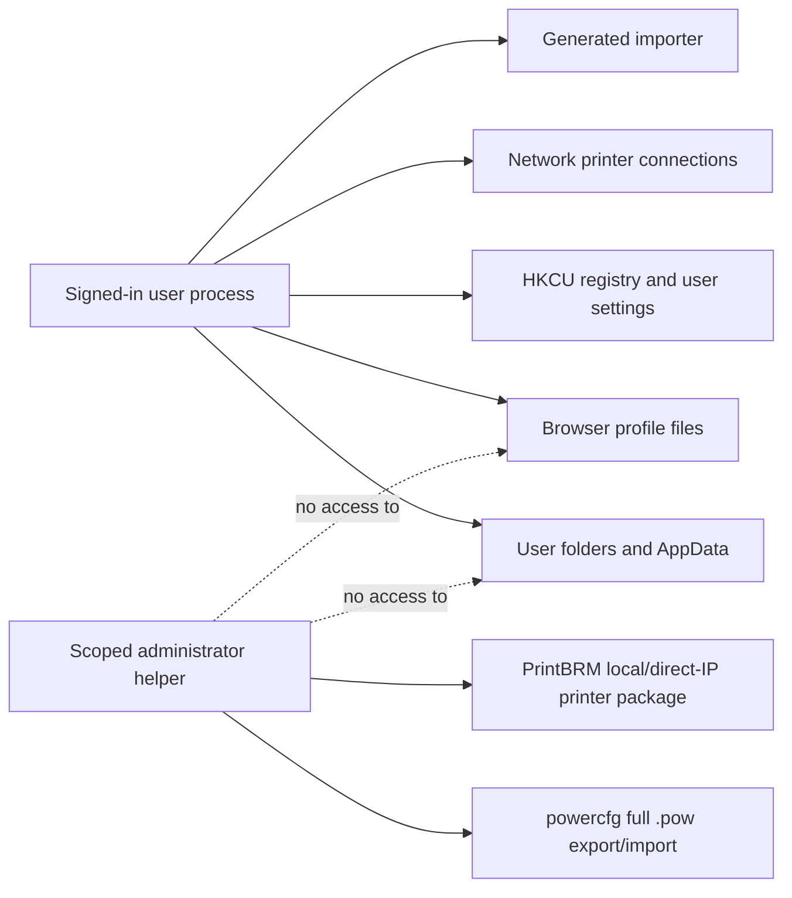
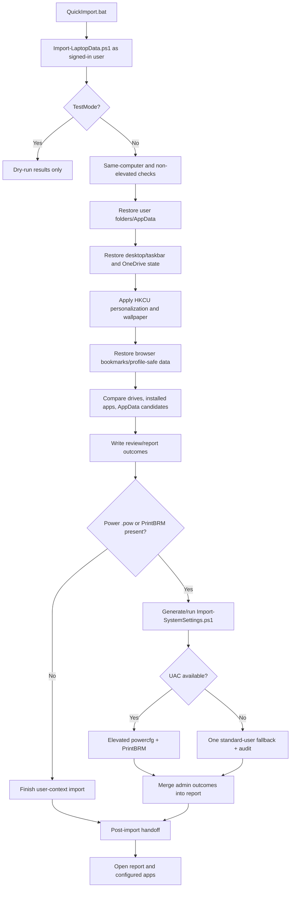

# Laptop Transfer Architecture

This document is the high-level technical guide for the STO Building Group laptop transfer tool. It is written for developers and engineers maintaining or extending the codebase.

> [!TIP]
> **Complete Technical Documentation Suite:**
> - 🔬 **[Exhaustive Technical Architecture & Deep Dive](docs/TECHNICAL_DEEP_DIVE.md)** — Stage-by-stage Windows OS internals, P/Invoke, COM interfaces, and Robocopy math.
> - 📊 **[Version Comparison & Lineage Matrix](docs/VERSION_COMPARISON.md)** — Detailed 26-dimension comparison of v0.7, v0.8, v0.9, and v1.0.
> - 📖 **[IT Technician Field Guide & SOP](docs/IT_TECHNICIAN_GUIDE.md)** — Standard operating procedure and technician checklists.
> - 🔍 **[Comprehensive Troubleshooting Guide](docs/TROUBLESHOOTING.md)** — Diagnostic decision tree and remediation procedures.

The tool is a PowerShell 5.1 application that runs on the old Windows laptop, builds a portable transfer package, and emits the scripts and evidence needed to restore that package on the replacement laptop.

## 1. System purpose and boundaries

The system does four related jobs:

1. Collect user files and selected application state from the old device.
2. Capture Windows settings and inventories that cannot be restored by copying files alone.
3. Package the result as either a local folder or an Online ZIP, with logs and a human-readable handoff report.
4. Generate an importer that restores what is safe to restore automatically and records the remainder as explicit manual work.

It is not a disk image, bare-metal backup, application installer, credential decryptor, or domain migration tool. Applications are inventoried; they are not installed. Windows-protected browser credentials are not decrypted. Default-app associations are documented rather than force-written.

## 2. Source-of-truth and build architecture

Technicians run `Export-LaptopData.ps1`, but developers edit the numbered modules in `src`. `Build-Deployment.ps1` concatenates the modules in dependency order, embeds `00-development-config.psd1` and `TransferReport.template.html`, syntax-checks the combined text, and writes the self-contained deployment artifact.



The module order is intentional:

| Module | Responsibility | Main public functions |
|---|---|---|
| `01-bootstrap.ps1` | Parameters, console initialization, admin detection, configuration and original-user context | script startup |
| `02-ui.ps1` | Console theme, banners, status cards, encoding-safe display helpers | `Write-Banner`, `Write-Status`, `Clear-StoScreen` |
| `03-core.ps1` | Runtime settings, presets, logging, result tracking, copy runner, elevation request | `Show-TransferSettingsMenu`, `Copy-WithProgress`, `Start-ElevatedExport` |
| `04-destination.ps1` | Folder/drive selection, path safety, inventory, capacity checks, ZIP and network publication | `Select-TargetDrive`, `Select-TargetDestination`, `New-TransferArchive` |
| `05-user-data.ps1` | Standard folders, extra folders, full-profile remainder, AppData | `Copy-UserFolders`, `Copy-AppData` |
| `06-settings.ps1` | Power, registry, drives, and system settings | `Get-SystemSettings` |
| `06-layout.ps1` | Taskbar layout and default application inventory | Taskbar layout helpers |
| `06-appdata-review.ps1` | Installed programs and AppData review | `Get-InstalledPrograms`, AppData helpers |
| `06-printers.ps1` | Printer connection and PrintBRM capture | `Backup-Printers` |
| `07-browsers-onedrive.ps1` | Chrome, Firefox, Edge, and OneDrive handling | `Copy-BrowserData`, `Set-OneDriveLocalSync` |
| `08-import-template.ps1` | Generates the user importer and scoped admin helper | `New-ImportScript`, `New-AdminImportScript` |
| `09-report.ps1` | Builds the HTML handoff report | `New-TransferReport` |
| `10-main.ps1` | Orchestrates the export and emits `QuickImport.bat` | `Start-LaptopExport` |

The generated file contains both export code and template code for future imports. It is marked `GENERATED FILE - DO NOT EDIT DIRECTLY`; a change made only to `Export-LaptopData.ps1` will be overwritten by the next build.

## 3. Runtime dataflow



`Start-LaptopExport` is the orchestration boundary. Each stage records an action in `$Script:Results.Actions`, writes human-readable log entries, and generally converts missing/unsupported data into `Skipped`, `Warning`, or `Manual` rather than aborting the whole migration.

## 4. Configuration and runtime state

The compiled default configuration is defined in `src/00-development-config.psd1` and copied into `$Script:DevelopmentConfig` during the build. `01-bootstrap.ps1` creates the runtime `$Script:Config` hashtable, applies only known Boolean switches, and separately allow-lists Online controls and Online import defaults. This prevents arbitrary new keys in the development file from silently changing technician behavior.

Important defaults:

| Area | Default behavior |
|---|---|
| Local mode | Full standard user-folder copy; no ZIP required |
| Online mode | Lean package, 5 GB ceiling, Downloads cap, Lotus local data omitted, OneDrive hydration skipped |
| Browser capture | Chrome, Firefox, and Edge enabled; Chrome raw archive is not included in lean Online mode |
| Settings | Power, mapped drives, personalization, desktop/taskbar layout, default-app inventory enabled |
| Printers | Network connection JSON plus a PrintBRM attempt; driver-inclusive PrintBRM is enabled |
| Import | User-context restore first; optional admin helper for power and PrintBRM; report and review artifacts enabled |

The Basic/Advanced preset is deliberately runtime-only. Basic disables `EntireUserProfile` and `AdditionalAppData`; Advanced enables both and presents a selectable, size-estimated AppData list. Any individual change marks the settings as Custom. Settings chosen in the menu are serialized as UTF-8 JSON, Base64-encoded, and passed to a UAC relaunch through `-RuntimeSettings`; the elevated process restores them so the operator does not repeat the menu.

The original user identity is preserved through `TargetUserProfile`, `TargetUserName`, `TargetAppDataRoaming`, and `TargetAppDataLocal`. This matters because an administrator process otherwise points at the administrator's profile and would collect the wrong data.

## 5. Security and Windows execution contexts

The most important architectural invariant is context separation:



### Export elevation

Elevation is opt-in and deferred until after settings confirmation. `Start-ElevatedExport` does not relaunch the complete exporter. It starts a narrowly scoped helper from `Start-ElevatedSystemExport`, passing only the package path. The helper contains no user-data routines, HKCU migration, drive mapping, or browser work. It retries the full power-plan export and PrintBRM capture where Windows permits them.

The **RECOMMENDED: Admin printer + power export** toggle is off by default in both Basic and Advanced. Regardless of that choice, the user-context exporter attempts power and PrintBRM first. When UAC is selected, the helper retries only the chosen system artifacts at the end and atomically replaces them only after a valid elevated result. `Settings\SystemExport.json` records per-artifact success and whether it was captured with administrator rights. Declining UAC leaves the standard-user artifacts intact and is recorded as optional, not a transfer failure.

### Import elevation

`QuickImport.bat` runs `Import-LaptopData.ps1` as the current signed-in user. The importer explicitly exits if it detects an elevated main process, because user-scoped restoration must target the new user's profile and HKCU. Normal-user printer connections and power settings are attempted first. At the end, it reports the per-artifact export provenance from `Settings\SystemExport.json` (or a legacy fallback), states that admin export is recommended but optional, and offers both system tasks, printers only, or power only through `Import-SystemSettings.ps1` with `Start-Process -Verb RunAs`. That helper writes `Logs/AdminImportResult.json` and retains the printer package after failure. If UAC is unavailable, the importer makes one explicit `-AllowStandardUser` printer-only fallback attempt and records the outcome.

### Credential and secret boundary

Chrome passwords are protected by Windows/Chrome and are not recovered by copying `User Data`. The exporter can guide the original user through Chrome's native password export, producing a plaintext CSV in `BrowserData/Chrome/PasswordExport`. The importer only makes the CSV available for Chrome's native import and warns that it must be protected and deleted. Firefox profile files are copied while Firefox is closed; Edge passwords and settings are expected to come from Microsoft account sync.

## 6. Destination selection, sizing, and transfer modes

Local mode uses the external/secondary-drive selector. Online mode uses the Windows folder picker or `-DestinationPath`. `Test-NetworkDestination` treats UNC paths, mapped network drives, and logical disks with `DriveType = 4` as network destinations.

Before copying, the tool performs a streaming recursive inventory in a background PowerShell job. Reparse points are excluded. Completed results populate a cache so the interactive settings menu stays responsive. `Get-TransferPayloadEstimate` sums only enabled stages and applies Online trimming rules. The tool then compares the estimate with the Online ceiling and destination free space. A warning is interactive; non-interactive validation fails safely instead of copying an unexpectedly large payload.

For an Online network destination, the normal path is:

1. Create `%LOCALAPPDATA%\STO Building Group\LaptopTransferStaging`.
2. Copy all package content locally.
3. Create a ZIP locally with `System.IO.Compression.ZipFile` at `CompressionLevel.Fastest`.
4. Upload the single ZIP with `robocopy.exe /Z /J`.
5. Compare source and destination ZIP sizes.

The staging folder is retained for recovery. ZIP creation and upload can be cancelled with `S`; an incomplete ZIP/upload is removed while the source transfer folder is preserved.

## 7. Package layout

```text
LaptopTransfer_yyyyMMdd_HHmmss/
├── UserData/
│   ├── Documents/ Desktop/ Downloads/ Pictures/ Videos/ Music/ Favorites/
│   ├── Start Menu/
│   ├── ProfileRoot/              # loose profile-root files
│   ├── Additional/               # optional extra user folders
│   ├── FullProfile/              # optional remaining profile folders
│   └── OCS Documents/            # optional C:\OCS Documents
├── AppData/
│   ├── Bluebeam/
│   ├── Signatures/
│   ├── QuickAccess/
│   ├── Lotus_Local/
│   └── Additional/{Roaming,Local}/
├── Settings/
│   ├── SystemSettings.json
│   ├── MappedDrivesSnapshot.json
│   ├── PowerScheme.pow             # only when elevated export succeeds
│   ├── PowerSchemeDetails.txt
│   ├── TaskbarLayout.json
│   ├── DefaultApps.json
│   ├── InstalledPrograms.json
│   └── AppDataCandidates.json/.txt
├── BrowserData/
│   ├── Chrome/Bookmarks/*.html
│   ├── Chrome/User Data/            # Local mode or Online opt-in
│   ├── Chrome/PasswordExport/*.csv  # only if native export completed
│   ├── Firefox/{Roaming,Local}/
│   └── Edge/{Bookmarks,User Data}/
├── Printers/
│   ├── PrinterConnections.json
│   └── Printers.printerExport       # when PrintBRM succeeds
├── Logs/
│   ├── ExportLog.txt
│   ├── robocopy_*.log
│   ├── TransferReport.html
│   └── generated review/import logs
├── Import-LaptopData.ps1
├── Import-SystemSettings.ps1
└── QuickImport.bat
```

The importer is generated from `New-ImportScript` with placeholders replaced for source identity, import switches, Online defaults, post-import launch configuration, and app-comparison exclusions. The HTML report is generated from the embedded standalone template, with all action/task text HTML-encoded.

## 8. Export capabilities in detail

### User files and AppData

`Copy-UserFolders` resolves the canonical Start Menu path to `%APPDATA%\Microsoft\Windows\Start Menu` instead of trusting the profile-root junction. Standard folders and loose root files use the common copy runner. Advanced full-profile mode copies only the remaining visible, non-reparse folders after excluding AppData, standard folders, cloud-sync folders, and known shell junctions. Online mode omits or prompts for large/optional folders and records a manual task for every omission.

`Copy-AppData` uses curated paths: Bluebeam in either known Roaming location, Microsoft signatures, Quick Access's `f01b4d95cf55d32a.automaticDestinations-ms`, and Lotus under Local AppData. Quick Access is copied as a file rather than enumerated through Shell COM to avoid mutating the user's pins.

All bulk folder copies flow through `Copy-WithProgress`, which starts `robocopy.exe` with `/E`, retries, and multithreading, then interprets Robocopy's 0–7 exit range as success. The monitor asynchronously counts Robocopy's per-file `100%` completion events to render a file-based progress bar without recursively measuring a destination that is actively being written. Codes 8/9 are accepted as successful when files were copied; other outcomes become warnings/errors.

### Windows settings

`Get-SystemSettings` writes JSON plus native Windows artifacts:

- Power: `powercfg /getactivescheme`, `powercfg /qh`, `powercfg /query`, the Windows Power Mode overlay reported by `PowrProf` (with a registry snapshot retained for compatibility), parsed AC/DC setting values, lid actions, and—when elevated—`powercfg /export` to `.pow`.
- Mapped drives: active `Get-PSDrive` UNC mappings plus persistent `HKCU:\Network\*` mappings, preserving letter/path pairs.
- Default browser: the per-user `http` `UserChoice` ProgId.
- Personalization: `HKCU` theme, DWM, accent, taskbar, search, mouse pointer style, Night light, desktop icon, visual-effect, DPI, per-monitor DPI, accessibility, and wallpaper values.
- Layouts: desktop position data through Explorer Shell/COM interop and taskbar state from the Taskband registry values.
- Default apps: file-extension and protocol association inventory from the per-user Explorer association keys. It is a snapshot, not a forced association migration.
- Installed programs: 64-bit HKLM, 32-bit Wow6432Node HKLM, and HKCU uninstall entries. A normalized display-name/publisher match key supports destination comparison.
- AppData candidates: non-system Local/Roaming top-level folders, with size and association hints, written to JSON and text for review.

### Printers

Printer handling has two complementary paths. `Get-Printer` captures per-user network connections and `Win32_Printer` via CIM identifies the default printer. This JSON can be restored without admin when drivers or v4 queues make it possible. `PrintBrm.exe` is located through `Sysnative` first for a 32-bit PowerShell process, then native `System32`; it attempts a real `.printerExport`, optionally including driver binaries. PrintBRM output is logged because Windows commonly requires elevation for local/direct-IP queues.

### Browsers

- Chrome: enumerate `Default` and `Profile N`; convert each `Bookmarks` JSON file to Netscape HTML; optionally copy the raw profile with cache directories excluded; optionally guide native password export.
- Firefox: require Firefox to be closed, copy both Roaming and Local profile trees, and omit disposable Local cache trees.
- Edge: enumerate Chromium profiles, export portable HTML, and retain each raw `Bookmarks` file so matching profiles can be restored.
- OneDrive: Local mode can force files offline using `attrib.exe`; Online mode deliberately skips force hydration and instructs the new-device operator to sign in and verify resync.

### Taskbar layout

Taskbar restoration inspects Shell items and verbs, removes only non-source pins with explicit logic, excludes Microsoft Store, retains/backs up relevant state, and reports unavailable destination applications.

## 9. Import dataflow



The importer is intentionally non-destructive in the areas where replacement is risky:

- Existing destination browser bookmarks are backed up under `%LOCALAPPDATA%\LaptopTransferBrowserBackups` before replacement.
- Desktop shortcut duplicate cleanup is confirmation-based and uses the Recycle Bin.
- Default apps are written to `Logs/DefaultAppsRestoreGuide.txt` and Windows Settings is opened; the protected `UserChoice` values are not force-written.
- App comparison and AppData review create `AppMigrationComparison.json` and `AppMigrationReview.html`; missing apps become checklist work, not an import failure.
- Network drives are compared by both letter and UNC path; conflicts are reported in `NetworkDriveComparison.txt` rather than silently remapped.

## 10. Error, result, and observability model

There are three evidence layers:

1. Console status: progress bars, stage summaries, warnings, and manual tasks.
2. Structured action state: `$Script:Results.Actions`, with category, item, status, and details.
3. Durable artifacts: `ExportLog.txt`, per-operation Robocopy/PrintBRM logs, JSON snapshots, import logs, and HTML reports.

The report orders handoff blockers ahead of ordinary successful rows. Admin-required omissions are presented as an explicit incomplete-export banner. Import outcomes are merged back into the original handoff report so a technician has one document to review.

Expected non-fatal outcomes include missing applications, absent folders, unsupported settings on new hardware, locked browser databases, lack of admin rights, unavailable PrintBRM, policy-rejected power settings, and Online-policy omissions. A new feature should preserve this behavior: isolate failures to the capability, record the reason, and provide a reproducible manual instruction.

## 11. Tests and developer workflow

The intended workflow is:

```powershell
powershell -ExecutionPolicy Bypass -File .\Build-Deployment.ps1
powershell -ExecutionPolicy Bypass -File .\Invoke-LaptopExportTests.ps1
```

The Pester suite does not perform a real laptop export. It validates build syntax and artifact generation, destination recursion protection, Online payload policy, ZIP cancellation cleanup, generated-import parsing, HTML encoding, `-TestMode` import behavior, Start Menu canonical paths, deferred elevation boundaries, layout/default-app safeguards, app review artifacts, power replication hooks, and network-drive/OneDrive logic.

When adding a capability:

1. Put implementation in the smallest numbered source module that owns it.
2. Add configuration only through the allow-listed configuration paths.
3. Decide explicitly whether the capability is user-context, scoped-admin, or manual-only.
4. Add a result row and durable log/report evidence for success, skip, and failure.
5. Add a non-destructive test, preferably against `$TestDrive` or synthetic JSON.
6. Rebuild the generated deployment file and validate that it parses.
7. Update this document and `README.md` if the package contract or technician workflow changes.

## 12. Extension rules and pitfalls

- Do not edit `Export-LaptopData.ps1` directly.
- Do not run the main importer elevated; it would redirect user data and HKCU to the wrong identity.
- Do not assume a Windows path is local: UNC, mapped drives, OneDrive, junctions, and reparse points need separate handling.
- Do not copy live browser databases and label them successful; close-process checks are part of data correctness.
- Do not decrypt or infer Windows-protected credentials.
- Do not force protected default-app `UserChoice` writes.
- Do not delete a source package after ZIP/upload failure; recovery depends on the retained folder.
- Do not treat a Robocopy exit code as a normal process exit code; interpret its documented 0–7 success range and inspect logs for partial-copy codes.
- Preserve backward compatibility in generated import templates. Existing packages may omit newer fields such as `MatchKey`, per-profile bookmark files, or managed power plans.

## 13. Known Strengths & Limitations

### Known Strengths
- **Enterprise Fidelity:** Migrates complex user state (Bluebeam, Outlook signatures, Quick Access binary stores, Lotus Notes, OST, PowrProf power overlays, Taskbar pin ordering).
- **Context Isolation:** Scoped elevation invariant guarantees `$env:USERPROFILE` and `HKCU:` are never corrupted by admin token switching.
- **High Performance:** Zero-I/O Robocopy parallel copies (`/MT:16`), non-blocking background sizing jobs, and fast local staging with unbuffered network uploads.
- **Fail-Safe Resilience:** Win32 handle canonicalization, live `S` key step-cancellation, and atomic JSON replacement (`SystemExport.json`).

### Known Limitations
> [!WARNING]
> **Stability & Field Maturity (v0.8 vs v1.0 as of August 18, 2026):**
> - **v0.8 Baseline:** Exceptionally stable and **rigorously battle-tested** in production enterprise environments.
> - **v1.0 Release:** Introduces significant advanced subsystems (PowrProf C-interop, Taskbar shell reconciliation, native Chromium bookmark JSON injection, Shell BitLocker inspection, zero-I/O monitor). While it passes all 28+ Pester automated unit/regression tests and is **mostly tested to work properly as of August 18, 2026**, it is **not yet 100% field-stabilized** across every possible corporate hardware OEM/docking configuration.
> - **Codebase Complexity:** The codebase is extremely complex (13 interrelated modules, dynamic C# interop, COM objects, multi-threaded runspaces, generated templates) and requires senior PowerShell systems engineering expertise to maintain.

## 14. Key files for code navigation

- [Build-Deployment.ps1](Build-Deployment.ps1) — compiler and module order.
- [src/01-bootstrap.ps1](src/01-bootstrap.ps1) — parameters, identity, configuration bootstrap.
- [src/03-core.ps1](src/03-core.ps1) — runtime settings, logging, copy runner, elevation request.
- [src/04-destination.ps1](src/04-destination.ps1) — destination safety, size checks, ZIP, network upload.
- [src/05-user-data.ps1](src/05-user-data.ps1) — user folders and AppData.
- [src/06-settings.ps1](src/06-settings.ps1) — Windows power, registry, drive, and system settings.
- [src/06-layout.ps1](src/06-layout.ps1) — taskbar layout and default application inventory.
- [src/06-appdata-review.ps1](src/06-appdata-review.ps1) — installed programs and AppData review.
- [src/06-printers.ps1](src/06-printers.ps1) — printer connection and PrintBRM capture.
- [src/07-browsers-onedrive.ps1](src/07-browsers-onedrive.ps1) — browser and OneDrive behavior.
- [src/08-import-template.ps1](src/08-import-template.ps1) — generated user importer and admin helper.
- [src/09-report.ps1](src/09-report.ps1) — report composition.
- [src/10-main.ps1](src/10-main.ps1) — top-level export pipeline.
- [tests/Export.Core.Tests.ps1](tests/Export.Core.Tests.ps1) — behavior and contract tests.
