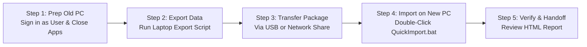

# Laptop Transfer Tool — IT Technician Field Guide & SOP

**STO Building Group IT Support Standard Operating Procedure (SOP)**  
*Tool Version: 1.0*

This guide provides a practical, step-by-step Standard Operating Procedure for IT Technicians, Help Desk specialists, and Field Engineers performing laptop refreshes and data migrations.

---

## 1. Quick-Start Cheat Sheet



### The 3 Golden Rules of Laptop Transfer:
1. **Always Sign in as the User:** Run both export and import while logged in as the employee being transferred (or IT admin logged into the user's desktop session). **Never** run the main script from an Administrator desktop session, as it will capture the administrator's profile instead.
2. **Close All Browsers Before Exporting:** Chrome, Firefox, and Edge lock their database files while running. Ensure browsers are closed before starting the export.
3. **Run QuickImport.bat as Standard User:** On the new machine, double-click `QuickImport.bat`. It will restore all user data first, and only prompt for Administrator approval at the very end for system power settings and printers.

---

## 2. Pre-Migration Checklist (On Old Laptop)

Complete these quick checks before launching the tool:

- [ ] **User Account:** You are logged into Windows as the user being transferred.
- [ ] **Browsers Closed:** Google Chrome, Mozilla Firefox, and Microsoft Edge are completely closed.
- [ ] **Outlook / Bluebeam Closed:** Microsoft Outlook, Teams, and Bluebeam Revu are closed so signature files and toolsets are unlocked.
- [ ] **BitLocker Verified:** The OS drive is fully encrypted (the tool checks this automatically, but confirm no decryption is in progress).
- [ ] **Transfer Destination Ready:**
  - **Local Transfer:** External USB 3.0 / SSD drive plugged in with sufficient free space (check size of `C:\Users\<username>`).
  - **Online Transfer:** Laptop connected to high-speed office LAN or Wi-Fi with write permissions to an approved network share (e.g., `\\fileserver\transfers$`).

---

## 3. Step-by-Step Export Procedure (On Old Laptop)

### Step 3.1: Launch the Export Tool
Open Windows File Explorer, navigate to the tool directory, and run **`RunLaptopExport-v1.0.bat`** (or `QuickExport.bat`).

```cmd
RunLaptopExport-v1.0.bat
```
*(This batch file automatically downloads the latest verified version from GitHub, verifies the file, and launches the export).*

Alternatively, launch PowerShell as the user:
```powershell
powershell -ExecutionPolicy Bypass -File ".\Export-LaptopData.ps1"
```

---

### Step 3.2: Select Transfer Mode

The tool presents the Transfer Mode screen:

```text
  [1] Local transfer   (external/USB drive; full copy)
  [2] Online transfer  (network share / cloud sync; lean package)
  [3] Administrator    (relaunch with elevated privileges)
```

| Transfer Mode | Recommended Scenario | Behavior |
|---|---|---|
| **[1] Local** | Laptop is physically in IT office; USB external drive or portable SSD is connected. | Full user folder copy. Fast and unconstrained. ZIP creation is optional. |
| **[2] Online** | Remote laptop, Wi-Fi transfer, or copying directly to a company network share. | Lean package optimized for network speed. Downloads capped at 5 GB (prompts if larger). Stages files locally in `%LOCALAPPDATA%`, creates a fast ZIP, and uploads the single archive. |

---

### Step 3.3: Choose Settings Preset & Review Transfer Settings

After selecting mode, the **Overview of Backup** screen displays estimated payload size:

```text
  [1] Start transfer  [2] Change settings  [3] Cancel
```

Press **`2`** to customize settings if needed. The **Transfer Settings** master panel opens:

```text
  SETTINGS PRESET: BASIC    [B] Basic  [V] Advanced
  
  [ 1] ON  User data                      Documents, Desktop, and other user folders
  [ 2] ON  Downloads                      Downloads folder
  [ 3] OFF Entire user profile            Copy remaining profile folders
  [ 4] OFF Additional AppData folders     Choose extra Local/Roaming folders
  [ 5] ON  AppData                        Bluebeam, signatures, and Quick Access
  [ 6] ON  Lotus Notes                    Local Lotus Notes data from AppData\Local
  [ 7] ON  System settings                Power, drives, personalization, and related settings
  [ 8] ON  Installed programs             Installed-program inventory
  [ 9] ON  AppData candidates             Review-only inventory of non-system application folders
  [10] ON  Printers                       PrintBRM package and printer connections
  [11] BOOKMARKS + PASSWORDS Google Chrome Off, bookmarks + passwords, or full profile
  [12] ON  Firefox                        Firefox profile, bookmarks, logins, extensions, and settings
  [13] ON  Microsoft Edge                 Edge bookmarks and profile-specific favorites
  [14] ON  OneDrive                       Offline file availability check
  [15] ON  Taskbar layout                 Pinned app shortcuts and taskbar layout
  [16] ON  Default apps                   File and protocol default-app inventory
  
  [17] OFF ALPHA: UAC printer + power export (OFF by default)
```

#### Preset Guidance:
- **Basic Preset (Default - Recommended for 95% of users):** Copies standard user folders, curated AppData (Bluebeam, Signatures, Quick Access, Lotus, OST), Chrome/Edge bookmarks, Firefox profile, Taskbar pins, system personalization, and network printers.
- **Advanced Preset:** Press **`V`** to enable `EntireUserProfile` (copies non-standard profile folders) and open the **Advanced AppData Selection** screen to choose specific vendor folders from `AppData\Local` or `AppData\Roaming`.
- **Alpha UAC Printer + Power Toggle (#17):** Toggle to **ON** only when you want to try the Alpha UAC capture. It can fall back to the standard-user attempt even after UAC approval. **Note:** User data stays strictly in the user's context; UAC is requested only for a short helper at the end.

Press **`S`** to Start Transfer.

---

### Step 3.4: Select Destination

- **Local Mode:** Select the drive letter of your external USB drive from the numbered list.
- **Online Mode:** A modern Windows folder browser dialog opens. Navigate to your network share or destination folder (e.g., `\\server\transfers\<TicketNumber>`) and click **Select Folder**.

The tool validates that the destination is outside the user profile, verifies free space, and begins the copy.

---

### Step 3.5: Monitor Export Progress & Complete

The tool copies each category with a live progress display:

```text
  ▸ Documents  4.12 GB / 1,420 files
    ⠋ Copying 1420 files (4.12 GB)  elapsed 18 sec
```

> [!TIP]
> **Skipping Large Folders:** If a particular folder is taking too long or is stuck on unwanted large files (e.g. video files), press **`S`** on the keyboard. The tool will stop copying *only that folder*, log it as skipped, and immediately proceed with the rest of the export.

Once complete:
- If Admin Export was toggled ON, a UAC prompt appears. Approve it to let the scoped helper capture the power plan and PrintBRM package.
- If Chrome Passwords were selected, follow the prompt to open Chrome Password Manager and export the CSV if requested by the user.
- The tool displays a **Summary Card** and automatically opens **`TransferReport.html`**.

---

## 4. Transfer Package Contents

The resulting package is stored in `LaptopTransfer_YYYYMMDD_HHMMSS/` (and zipped as `LaptopTransfer_YYYYMMDD_HHMMSS.zip` for Online transfers):

```text
LaptopTransfer_20260818_223000/
├── UserData/              # Desktop, Documents, Downloads, Favorites, Start Menu, Pictures, etc.
├── AppData/               # Bluebeam Revu preferences, Outlook signatures, Quick Access pins
├── Settings/              # SystemSettings.json, Taskbar pins, Mapped Drives, Wallpaper
├── BrowserData/           # Chrome, Edge, and Firefox bookmarks and profiles
├── Printers/              # Network printer connections & PrintBRM package
├── Logs/                  # ExportLog.txt, robocopy logs
├── Import-LaptopData.ps1  # Automated restoration PowerShell script
├── QuickImport.bat        # Standard-user one-click launcher
└── TransferReport.html    # Interactive handoff and audit report
```

---

## 5. Step-by-Step Import Procedure (On New Laptop)

### Step 5.1: Prepare New Laptop
1. Complete Windows Out-of-Box Experience (OOBE) / Autopilot imaging.
2. Sign into Windows as the **user being transferred**.
3. If using an Online ZIP, copy `LaptopTransfer_*.zip` to `C:\LaptopTransfers` (or Desktop) and extract it. If using USB, plug in the drive.

---

### Step 5.2: Launch QuickImport.bat

Open the extracted `LaptopTransfer_*` folder and **double-click `QuickImport.bat`**.

```cmd
QuickImport.bat
```

> [!IMPORTANT]
> **Do NOT right-click and select "Run as Administrator".**
> `QuickImport.bat` must start as the standard signed-in user so Windows restores files, registry settings, and taskbar shortcuts into the correct user profile!

---

### Step 5.3: Automated Restoration Process

The import script runs automatically:
1. **Restores User Folders:** Documents, Desktop, Downloads, Favorites, Pictures, Videos, Music, loose profile files.
2. **Restores Start Menu & AppData:** `%APPDATA%\Microsoft\Windows\Start Menu`, Bluebeam Revu settings, Outlook email signatures, Quick Access pins, and Lotus Notes data.
3. **Restores Personalization:** Dark/Light mode, Windows accent colors, Night Light schedules, taskbar alignment, mouse cursor size, and wallpaper.
4. **Restores Taskbar Layout:** Recreates pinned taskbar shortcuts, restores Taskband order, and removes unwanted default imaging pins.
5. **Restores Browsers:**
   - **Chrome & Edge:** Injects native bookmarks into matching browser profiles; places portable HTML bookmark files in `Desktop\Browser_Bookmarks` as backup.
   - **Firefox:** Restores full profile data (backups of existing new-PC data are saved to `Firefox_Backup_*`).
   - **Chrome Passwords:** If a password CSV exists, prompts to open Chrome Password Manager, verify import, and type `DELETE` to securely remove the plaintext CSV.
6. **Restores Network Drives & Printers:** Remaps persistent drives; re-adds network printer connections without admin.
7. **App Migration Review:** Compares applications from the old laptop against the new laptop.

---

### Step 5.4: Optional Elevated System Settings Helper

At the end of the user restore, the script displays the **System Export Provenance** and prompts for optional administrative tasks:

```text
  System-export provenance:
    Full power plan: Captured with administrator rights
    PrintBRM migration file: Captured with administrator rights

  [1] Retry printers and power settings with administrator rights
  [2] Retry printers only with administrator rights
  [3] Retry power settings only with administrator rights
  Select 1-3 (or press Enter to skip)
```

- If you have admin credentials, enter **`1`** (or **`2`** / **`3`**). A UAC prompt will appear to run `Import-SystemSettings.ps1`.
- If you do not have admin credentials, press **`Enter`** to skip. The import will finish successfully with standard-user results.

---

### Step 5.5: Post-Import Application Handoff

The script prompts:
```text
  Open the standard handoff applications too? (Y/N) [N]
```
Press **`Y`** to automatically launch key applications for technician verification:
- Adobe Acrobat / Bluebeam Revu
- Classic Outlook (verifies email profile & signatures)
- Microsoft Teams
- Cisco Secure Client / CMiC / Intranet

---

## 6. Post-Transfer Verification & Handoff

Before handing the new laptop to the employee:

1. **Review `TransferReport.html`:** The report opens in the default browser. Ensure there are zero critical red errors.
2. **Review `Logs\AppMigrationReview.html`:** Check the **Missing Applications** table. Install any specialized line-of-business software that was on the old machine but missing on the new build.
3. **Verify Outlook Signatures:** Open Outlook -> New Email -> Signatures. Confirm signatures are present.
4. **Verify Bluebeam Revu:** Open Bluebeam Revu. Confirm custom toolsets, stamps, and profiles are loaded.
5. **Verify Network Drives:** Open File Explorer -> This PC. Confirm drive letters (`G:`, `P:`, `S:`, etc.) are mapped.
6. **Verify Printers:** Open Windows Settings -> Printers & Scanners. Confirm network print queues are listed.
7. **Wipe Sensitive Password CSVs:** If Chrome password CSV export was used, confirm the CSV has been deleted from the transfer folder.

---

## 7. Troubleshooting Quick Reference

| Issue / Symptom | Root Cause | Solution |
|---|---|---|
| **"Incomplete Export: Admin-Only Items Were Not Captured" banner in report** | Export was run without Admin toggle, or UAC was declined. | Normal behavior. Standard-user files, settings, and network printers are 100% intact. Only full `.pow` power plan and local PrintBRM queues were skipped. No action needed unless user has a custom local USB printer. |
| **Robocopy Error 32 / Locked Files** | Chrome, Firefox, Outlook, or Teams was open during export. | Close all applications and re-run the export. Robocopy will skip already-copied files and only transfer the unlocked databases. |
| **"Selected destination is within the source profile"** | Technician selected `C:\Users\<user>\Desktop` or similar as destination. | Choose an external USB drive (`E:\`), a network share, or `C:\LaptopTransfers` / `C:\Users\<user>\AppData\Exports`. |
| **Chrome Passwords Missing on New Laptop** | Passwords are DPAPI-protected by Windows and cannot be copied via profile files. | Guide user through Chrome's native CSV password export on old laptop, then import on new laptop via `chrome://password-manager/settings`. |
| **Firefox profile not restoring** | Firefox was open on the new laptop during import. | Close Firefox completely and run `Import-LaptopData.ps1` again. |
| **QuickImport.bat prompts that it is running elevated** | Technician right-clicked and selected "Run as Administrator". | Close the window and simply double-click `QuickImport.bat` normally as the standard signed-in user. |
