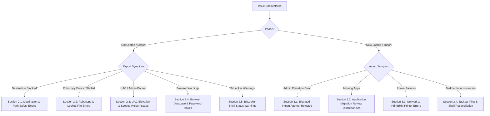

# Laptop Export & Transfer Tool — Comprehensive Troubleshooting Guide

**STO Building Group IT Support & Systems Engineering**  
*Tool Version: 1.0*

This guide provides deep technical troubleshooting workflows, root cause analyses, and resolution steps for every error, warning, edge case, and failure mode encountered during laptop data export and restoration.

---

## 1. Diagnostic Decision Tree



---

## 2. Export Phase Troubleshooting (Old Laptop)

### 2.1 Destination & Path Safety Errors

#### Error: *"Destination is inside the source and would create a recursive copy"* or *"Selected destination is within the source profile"*
- **Symptom:** The tool rejects the selected folder and halts before copying any files.
- **Root Cause:** The destination folder resolves (via Win32 handle canonicalization) to a subfolder inside `C:\Users\<username>` (such as `Desktop`, `Downloads`, `Documents`, or `C:\Users\<username>\Transfer`). If the exporter wrote files here, Robocopy would recursively copy its own destination folder in an infinite loop, exhausting disk space.
- **Resolution:**
  1. For **Local Transfers**, select an external drive (`D:\`, `E:\`) or a secondary fixed disk.
  2. For **Online / Disk Transfers**, select a dedicated root staging folder such as `C:\LaptopTransfers` or an authorized network share (e.g., `\\fileserver\transfers$\<ticket>`).
  3. If you *must* export to the local drive, use the supported in-profile exception: `C:\Users\<username>\AppData\Exports`.

#### Error: *"Could not create local staging folder '%LOCALAPPDATA%\STO Building Group\LaptopTransferStaging'"*
- **Symptom:** Online transfer fails during network staging initialization.
- **Root Cause:** Insufficient permissions in `$env:LOCALAPPDATA` or disk space exhaustion on drive `C:`.
- **Resolution:**
  1. Check free disk space on drive `C:`. Ensure at least 1.15× the estimated transfer payload is free.
  2. In **Transfer Settings** -> **Advanced Online Controls**, toggle **Stage network transfers locally** to `OFF` if network bandwidth is high and direct SMB writes are preferred.

---

### 2.2 Robocopy & Locked File Errors

#### Error: Robocopy Exit Code 8 or Exit Code 16 in `Logs\robocopy_*.log`
- **Symptom:** The console reports `Warning` or `Error` for a folder (e.g. `AppData`, `Documents`).
- **Understanding Robocopy Exit Codes:**
  - **Codes 0–7:** Normal success (0=no change, 1=files copied, 2=extra files present, 4=mismatched files).
  - **Code 8:** Some files could not be copied (usually file lock / sharing violation `ERROR 32`).
  - **Code 9 (8+1):** Some files failed, but other files in the same folder were successfully copied.
  - **Code 16:** Fatal error; Robocopy did not copy any files (access denied, path not found, network disconnected).
- **Resolution:**
  1. Open `Logs\robocopy_<folder>.log` inside the transfer package to identify the exact file paths that failed.
  2. If the failed files are locked database files (`.lock`, `parent.lock`, `History`, `Cookies`), identify the running application (e.g., Chrome, Edge, Firefox, Outlook, Teams) using Task Manager:
     ```powershell
     Get-Process chrome, msedge, firefox, outlook, teams -ErrorAction SilentlyContinue | Stop-Process -Force
     ```
  3. Re-run `Export-LaptopData.ps1`. Robocopy will automatically skip already-copied files and only transfer the previously locked items.

#### Issue: Transfer Appears Stalled on a Large File
- **Symptom:** The progress spinner continues spinning, but elapsed time is increasing without completing.
- **Resolution:**
  - Press **`S`** on the keyboard. The tool immediately sends a termination signal to `robocopy.exe`, logs the specific folder as `Skipped by operator`, and continues seamlessly with the next folder.
  - All files copied up to that point remain in the package.

---

### 2.3 UAC Elevation & Scoped Helper Issues

#### Banner: *"INCOMPLETE EXPORT: ADMIN-ONLY ITEMS WERE NOT CAPTURED"* in Report
- **Symptom:** The HTML report displays a prominent red banner stating admin rights were required.
- **Root Cause:** The export was run with **Admin printer + power export** toggle turned `OFF` (the default setting), or the technician clicked "No" on the final UAC prompt.
- **Impact Assessment:**
  - **Is data lost?** **NO.** 100% of user files (Desktop, Documents, Downloads, Favorites, Pictures), curated AppData (Bluebeam, Outlook signatures, Quick Access, Lotus Notes), browser bookmarks/profiles, taskbar pins, dark mode/themes, and network printer connections were captured completely as the standard user.
  - **What was omitted?** Only the full binary active power scheme file (`PowerScheme.pow`) and local USB/direct-IP printer queues via `PrintBrm.exe`.
- **Resolution:**
  - In 98% of corporate laptop migrations, standard-user capture is completely sufficient because the destination laptop receives the corporate standard power plan and network printers automatically.
  - If the user has custom local desktop USB label printers or specialized power plan timeouts, run the export again, toggle **RECOMMENDED: Admin printer + power export** to `ON`, and approve the UAC prompt at completion.

---

### 2.4 Browser Database & Password Issues

#### Warning: *"Chrome is open. Waiting up to 10 seconds for it to close..."*
- **Symptom:** Chrome was active when browser export began.
- **Root Cause:** SQLite database files (`Bookmarks`, `Cookies`, `Web Data`, `History`) are locked with exclusive write locks while Chromium is running.
- **Resolution:**
  - Close Chrome completely (check system tray for background Chrome processes: Task Manager -> End Task on `chrome.exe`).
  - If not closed, v1.0 automatically excludes non-portable volatile cache directories (`GPUPersistentCache`, `Network`, `Safe Browsing Network`) to minimize lock contention, but closing the browser is always best practice.

#### Issue: Chrome Passwords Not Restoring Automatically on New PC
- **Root Cause:** By design, Google Chrome encrypts passwords using Windows Data Protection API (DPAPI) tied to the user's Windows SID and hardware TPM. Raw database files cannot be decrypted on a different computer.
- **Resolution:**
  1. On the old laptop, run the export tool and follow the prompt to open `chrome://password-manager/settings`.
  2. Click **Export passwords** -> Enter Windows PIN/Password -> Save the CSV file to `BrowserData\Chrome\PasswordExport`.
  3. On the new laptop, run `QuickImport.bat`. Follow the prompt to open Chrome Password Manager and import the CSV.
  4. Type `DELETE` in the import console to permanently shred the plaintext CSV from the transfer folder.

---

### 2.5 BitLocker Shell Status Warnings

#### Warning: *"BitLocker is off for C:\ (fully decrypted; Shell status 2)"* or Status 3/4/5
- **Symptom:** The console and report flag a BitLocker warning for the OS drive.
- **Root Cause:** v1.0 queries `Shell.Application` COM `ExtendedProperty('System.Volume.BitLockerProtection')`:
  - `1` = Protection On (Encrypted & Secure)
  - `2` = Protection Off (Decrypted)
  - `3` = Encryption in progress
  - `4` = Decryption in progress
  - `5` = Protection Suspended
- **Resolution:**
  - If Status is 2 or 5, check corporate BitLocker compliance policy before moving user data off the machine. Re-enable BitLocker via Control Panel -> BitLocker Drive Encryption or `manage-bde -protectors -enable C:`.

---

## 3. Import Phase Troubleshooting (New Laptop)

### 3.1 Elevated Import Attempt Rejected

#### Error: *"Import script was launched as Administrator. Please run as the signed-in standard user."*
- **Symptom:** `Import-LaptopData.ps1` or `QuickImport.bat` terminates immediately on the new laptop.
- **Root Cause:** The technician right-clicked `QuickImport.bat` and selected "Run as Administrator". When running elevated, `$env:USERPROFILE` points to `C:\Users\Administrator` and `HKCU:` points to the Admin registry hive, which would cause all restored files, taskbar shortcuts, and settings to be written into the wrong user account.
- **Resolution:**
  - Simply double-click `QuickImport.bat` normally (or execute `powershell -ExecutionPolicy Bypass -File .\Import-LaptopData.ps1` from a standard, non-elevated command prompt).
  - The script will restore all user profile data first, and will cleanly launch its own elevated helper (`Import-SystemSettings.ps1`) at the end for system tasks.

---

### 3.2 Application Migration Review Discrepancies

#### Symptom: `Logs\AppMigrationReview.html` lists missing applications
- **Understanding App Migration:** The transfer tool does **not** install applications; it performs an intelligent audit comparison between the old and new PC uninstall registries (64-bit, 32-bit Wow6432Node, and HKCU).
- **How Exclusions Work:**
  - Common runtime libraries (`Microsoft Visual C++`, `.NET Framework`, `DirectX`), Windows updates (`KB*`), hardware drivers (`Intel`, `Realtek`, `NVIDIA`), and core corporate apps (`Microsoft 365`, `Teams`, `OneDrive`, `Adobe Acrobat`) are automatically filtered out by `AppComparisonExcludePatterns` regex rules because they are handled by standard corporate imaging.
- **Resolution:**
  - Review the **Missing Applications** table in `AppMigrationReview.html`.
  - Open Company Portal, Intune, or software deployment tools to install any specialized line-of-business applications (e.g. AutoCAD, Revit, specialized estimating tools) that were on the old device.

---

### 3.3 Network & PrintBRM Printer Errors

#### Error: *"PrintBRM did not restore Printers.printerExport"* or *"Exit code 1"*
- **Root Cause:**
  1. The new laptop lacks the required printer drivers in its driver store.
  2. The printer was a direct-IP or local printer that requires driver staging before queue creation.
- **Resolution:**
  - Check `Logs\printbrm_restore.log` for the exact spooler error.
  - For network printers (`\\server\queue`), the standard-user importer already restored the connections via `Printers\PrinterConnections.json`. Confirm network printer visibility in Windows Settings -> Printers & Scanners.
  - If a local USB printer queue failed to restore, install the manufacturer driver package on the new laptop and re-run the PrintBRM helper:
    ```powershell
    powershell -ExecutionPolicy Bypass -File ".\Import-SystemSettings.ps1" -Scope Printers
    ```

---

### 3.4 Taskbar Pins & Shell Reconciliation

#### Symptom: Default Windows pins (e.g., Edge, Store, Teams) appeared alongside migrated pins
- **Root Cause:** Windows 11 Autopilot/imaging policies occasionally re-inject default pinned shortcuts when Explorer starts for a new user.
- **Resolution:**
  - The v1.0 importer automatically runs a two-pass shell reconciliation: it backs up Taskband registry data, replaces pin shortcuts in `%APPDATA%\Microsoft\Internet Explorer\Quick Launch\User Pinned\TaskBar`, restarts `explorer.exe`, and unpins non-source shortcuts.
  - If corporate Group Policy or Intune pushes mandatory pins later, those are managed by organizational policy outside the transfer tool's boundary.

---

## 4. Disaster Recovery & Emergency Procedures

### 4.1 Recovering from an Interrupted Transfer
If a transfer is interrupted by power loss, network disconnection, or accidental closure:
1. **Source Data Is Never Modified:** The export process is 100% read-only on the old laptop. The source profile is completely intact.
2. **Local Staging Persistence:** For Online transfers, files are staged in `%LOCALAPPDATA%\STO Building Group\LaptopTransferStaging` before upload. If the network upload fails, the local staging folder is retained and can be copied manually to a USB drive.
3. **Resumption:** Simply re-run the export script. Robocopy will scan the destination and skip all files that were already copied, resuming immediately where it stopped.

### 4.2 Restoring from Raw Folders Manually
If PowerShell execution is blocked on the destination PC by an unconfigured ExecutionPolicy:
1. All user files are stored in plain, unencrypted, standard folder structures under `UserData\`. You can drag-and-drop `Documents`, `Desktop`, `Downloads`, `Pictures`, and `Favorites` directly into `C:\Users\<newuser>\`.
2. Outlook email signatures can be copied directly from `AppData\Signatures` to `%APPDATA%\Microsoft\Signatures`.
3. Bluebeam settings can be copied directly from `AppData\Bluebeam` to `%APPDATA%\Bluebeam Software`.
4. Bookmarks can be imported manually into Chrome/Edge by opening `chrome://bookmarks` -> Click `...` -> **Import bookmarks** -> Select `BrowserData\Chrome\Bookmarks\Chrome_Bookmarks_Default.html`.
