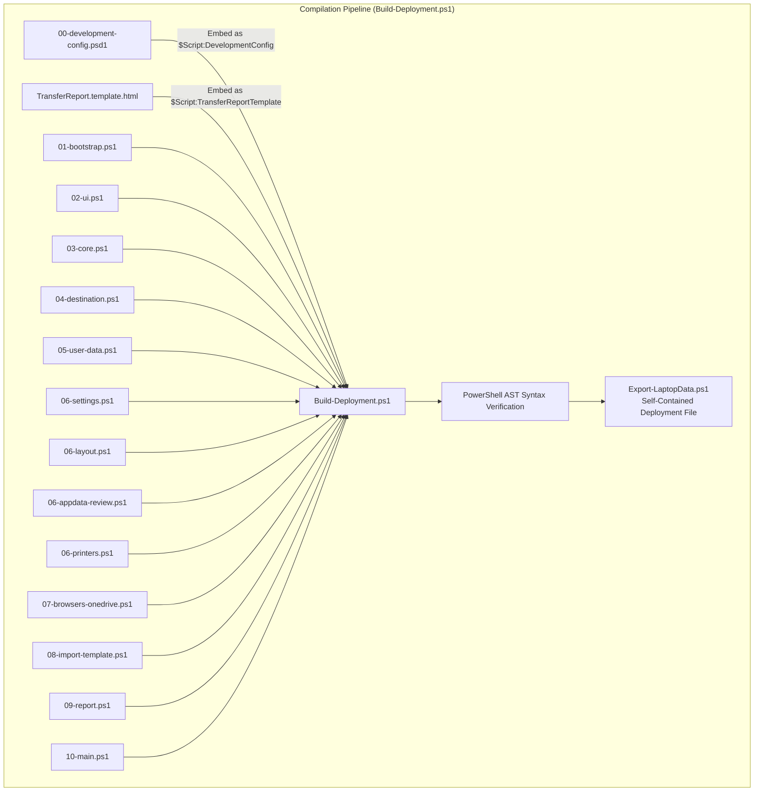

# Source Module Architecture & Compiler Reference

This directory contains the modular source code for the **STO Building Group Laptop Transfer Tool (v1.0)**.

---

## 1. Build Pipeline & Compilation Model

Technicians execute the self-contained `Export-LaptopData.ps1` in production, but all development occurs across the numbered `.ps1` modules in this directory.

`Build-Deployment.ps1` reads `src/` modules in strict dependency order, embeds the trusted development configuration (`00-development-config.psd1`) and HTML report template (`TransferReport.template.html`), validates syntax via the .NET PowerShell AST Parser (`[System.Management.Automation.Language.Parser]::ParseInput`), and writes the final UTF-8 BOM deployment artifact.



To rebuild after making changes:
```powershell
powershell -ExecutionPolicy Bypass -File ".\Build-Deployment.ps1"
```

---

## 2. Module Directory & Responsibility Index

The build order defined in `Build-Deployment.ps1` is authoritative. Declarations and shared helpers must precede the feature modules that consume them.

| Module | Primary Responsibility | Key Functions & Exported Artifacts |
|---|---|---|
| [`00-development-config.psd1`](00-development-config.psd1) | Compile-time & runtime defaults | Backup/Import/Export/Online allow-listed hashtable defaults. |
| [`01-bootstrap.ps1`](01-bootstrap.ps1) | Parameters & VT/ANSI console setup | Script `param()` block, UTF-8 output encoding, Win32 `SetConsoleMode` VT interop, `$Script:Theme`. |
| [`02-ui.ps1`](02-ui.ps1) | Presentation & formatting helpers | `Write-Banner`, `Write-Status`, `Write-KeyValue`, `Write-SummaryCard`, `Convert-ToGradient`, `Clear-StoScreen`. |
| [`03-core.ps1`](03-core.ps1) | Core state machine & progress runner | Presets (`Set-SettingsPreset`), background sizing (`Start-TransferSizeEstimateJob`), `Copy-WithProgress` (Robocopy `/MT:16` zero-I/O runner), `Add-Result`, `Write-Log`. |
| [`04-destination.ps1`](04-destination.ps1) | Target resolution, safety & ZIP engine | Win32 `CreateFile`/`GetFinalPathNameByHandle` canonical traversal, `Test-PathIsSameOrChild`, COM `IFileDialog` picker, `New-TransferArchive`, `Publish-TransferArchive`. |
| [`05-user-data.ps1`](05-user-data.ps1) | User folders & Curated AppData | `Copy-UserFolders` (Start Menu canonical resolution), `Copy-EntireUserProfile`, `Copy-AppData` (Bluebeam, Outlook signatures, Quick Access, Lotus, OST). |
| [`06-settings.ps1`](06-settings.ps1) | Windows settings, BitLocker & PowrProf | `Test-OperatingSystemDriveBitLocker` (Shell COM), `Get-WindowsPowerMode` (PowrProf P/Invoke), `powercfg /qh` parser, registry exports, `SystemExport.json` atomic provenance. |
| [`06-layout.ps1`](06-layout.ps1) | Taskbar layout & default apps | `Backup-TaskbarLayout` (pinned links & Taskband order), `Backup-DefaultApps` (file extension & protocol snapshot). |
| [`06-appdata-review.ps1`](06-appdata-review.ps1) | App migration & candidate inventory | `Get-InstalledPrograms` (64/32/HKCU hives + `Get-ProgramMatchKey`), `Get-AppDataCandidates`, `Select-AdditionalAppData`. |
| [`06-printers.ps1`](06-printers.ps1) | Dual-track printer migration | `Backup-Printers` (Track 1: non-admin `Win32_Printer`/`Get-Printer` JSON; Track 2: Sysnative `PrintBrm.exe` package). |
| [`07-browsers-onedrive.ps1`](07-browsers-onedrive.ps1) | Browser engine & OneDrive state | `Convert-ChromeBookmarksToHtml`, `Export-ChromeBookmarks` (native JSON + HTML), Firefox profile copy, native password CSV workflow, OneDrive hydration checks. |
| [`08-import-template.ps1`](08-import-template.ps1) | Importer generator & admin helper | `New-ImportScript` (generates `Import-LaptopData.ps1` with Base64 config injection), `New-AdminImportScript` (generates `Import-SystemSettings.ps1`). |
| [`09-report.ps1`](09-report.ps1) | Standalone HTML report engine | `New-TransferReport` (action priority sorting, UTF-8 BOM encoding, dynamic token substitution). |
| [`10-main.ps1`](10-main.ps1) | Top-level lifecycle orchestrator | `Start-LaptopExport`, `New-QuickImportBatch` (generates `QuickImport.bat`), summary cards, report launching. |
| [`TransferReport.template.html`](TransferReport.template.html) | Standalone HTML report template | Responsive CSS, collapsible audit sections, handoff checklist, and print-ready styles. |

---

## 3. Developer Guidelines & Safety Boundaries

When modifying or extending source modules:

1. **Preserve the Shared Script Scope:** All modules execute within the shared `$Script:` scope. Do not encapsulate modules in private sub-functions unless intended.
2. **Preserve the Scoped Elevation Boundary:** Never place user-scoped capture routines in elevated blocks. User folders, HKCU registry keys, and browser databases must always be queried in the standard user context.
3. **Always Use Canonical Path Helpers:** Never assume string concatenation is sufficient for directory paths. Always use `Join-Path` and `Test-PathIsSameOrChild` to prevent directory traversal or recursive loops.
4. **HTML Escape All Dynamic Text:** All user-controlled strings (usernames, folder names, printer names, error messages) must pass through `Out-HtmlEncoded` before being injected into HTML reports.
5. **Update and Run Pester Tests:**
   After making any code changes, rebuild the deployment and execute the test harness:
   ```powershell
   powershell -ExecutionPolicy Bypass -File ".\Build-Deployment.ps1"
   powershell -ExecutionPolicy Bypass -File ".\Invoke-LaptopExportTests.ps1"
   ```
